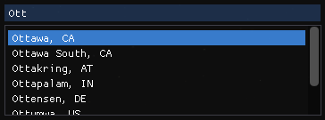

# GeoNames

### Usage

```c++
#include "geo_names.hpp"

std::vector<GeoNames> results;
GetGeoNames(results, 8, "ott");
for (const GeoNames& result : results)
{
    std::println("Found \"{}\" at {},{}", result.Location, result.Latitude, result.Longitude);
}
```

To use it with ImGui, you can provide your own widget or use the provided one.

```c++
#include "geo_names_imgui.hpp"

std::optional<GeoNames> result = GetImGuiGeoNames();
if (result.has_value())
{
    // ...
}
```

